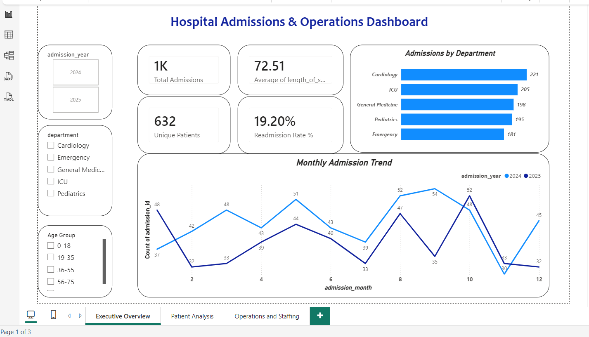
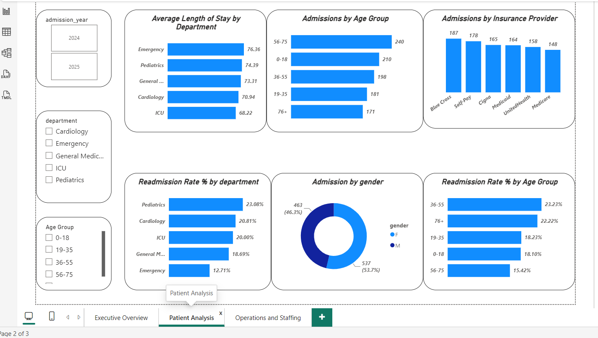
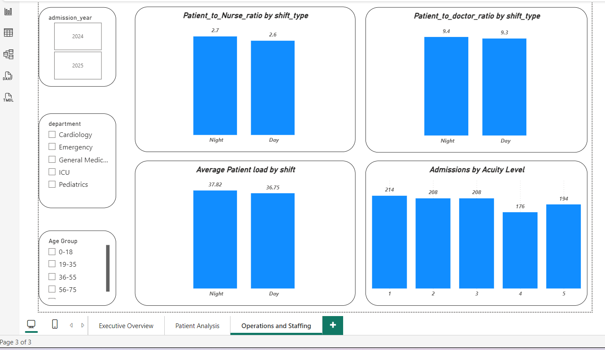

# healthcare-operations-analysis
Healthcare Operations Analysis using SQL Server and Power BI
   
   
    # Project Overview
This project analyzes hospital admissions, patient demographics, readmission patterns, and staffing operations using Microsoft SQL Server and Power BI.

The dataset was  generated using Mockaroo and contains information on patients, admissions, and hospital staffing activities between January 2024 and December 2025.
  # Tools Used
      - Microsoft SQL Server
      - Power BI
      - Mockaroo (Data Generation)

 # Dataset
The project contains three tables:

    Patients
     - Patient demographics
     - Gender
     - Age
     - Insurance Provider
    Admissions
      - Admission and discharge details
      - Department
      - Acuity Level
      - Length of Stay
      - Readmission Analysis
    Staffing Log
       - Shift Information
       - Scheduled Nurses
       - Scheduled Doctors
       - Patient Load

# SQL Concepts Used
 *  Joins
 *  Views
 *  Common Table Expressions (CTEs)
 *  Window Functions (LEAD)
 *  CASE Statements
 *  DATEDIFF
 *  Aggregations

# Business Questions Answered
 (?) Which department receives the most admissions?
 ? What are the monthly admission trends?
 ? Which age groups contribute the most admissions?
 ? What is the average length of stay by department?
 ? Which departments have the highest readmission rates?
 ? How does staffing vary by shift?
 ? What are the patient-to-nurse and patient-to-doctor ratios?

# Dashboard Pages
     1) Executive Overview
           + Total Admissions
           + Unique Patients
           + Average Length of Stay
           + Readmission Rate
           + Admissions by Department
           + Monthly Admission Trend
     2) Patient Analysis
            + Admissions by Age Group
            + Admissions by Gender
            + Admissions by Insurance Provider
            + Readmission Rate by Age Group
            + Averrage lenght of stay by Department 
            + Readmission Rate % by Department 
      3) Operations and Staffing
            + Patient-to-Nurse Ratio
            + Patient-to-Doctor Ratio
            + Patient Load by Shift
            + Admissions by Acuity Level
## Dashboard Preview

### Executive Overview

### Patient Analysis

### Operations and Staffing

   
    
    BY
    Siddheh Gadadhare

